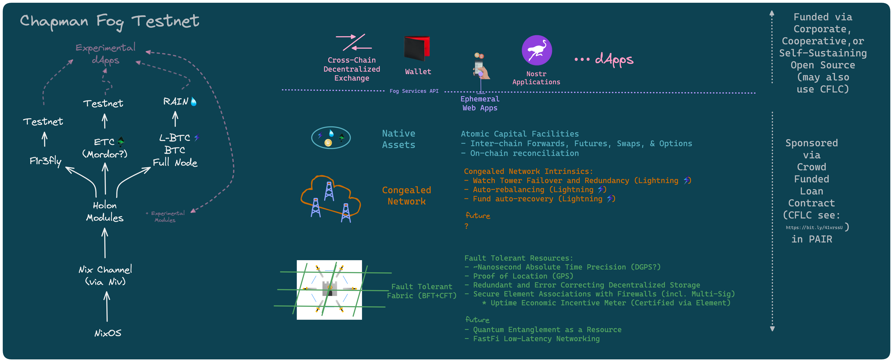

# Bitcoin Derivatives with AI assitance
## THIS IS A TEST - I AM CHANGING THE README FILE
## Repo for a Chapman University blockchain testnet and CPSC-370 course. 

The methods and results of this project will be taught in the Fall 2023 course CPSC-370 *The Decentralized Web and Scalable Blockchain Programming*.

## Team members: 
- Jeff Turner - instructor
- Stephen Preston (ComposeDAO assistant)
- Alexander Kurz (Professor in Fowler School of Engineering)
- Lucius Gregory Meredith (Inventor of Rholang, CEO of F1r3fly.io)

## Lectures
- [29-Aug-2023](./lectures/lecture01.md)
- [31-Aug-2023](./lectures/lecture02.md)
- [5-Sept-2023](./lectures/lecture03.md)
- [7-Sept-2023](./lectures/lecture04.md)
- [12-Sept-2023](./lectures/lecture05.md)
- [14-Sept-2023](./lectures/lecture06.md)
- [19-Sept-2023](./lectures/lecture07.md)
- [21-Sept-2023](./lectures/lecture08.md)
- [26-Sept-2023](./lectures/lecture09.md)
- [28-Sept-2023](./lectures/lecture10.md)
- [3-Oct-2023](./lectures/lecture11.md)
- [5-Oct-2023](./lectures/lecture12.md)
- [10-Oct-2023](./lectures/lecture13.md)
- [12-Oct-2023](./lectures/lecture14.md)
- [17-Oct-2023](./lectures/lecture15.md)
- [19-Oct-2023](./lectures/lecture16.md)
- [24-Oct-2023](./lectures/lecture17.md)
- [26-Oct-2023](./lectures/lecture18.md)
- [31-Oct-2023](./lectures/lecture19.md)
- [2-Nov-2023](./lectures/lecture20.md)
- [7-Nov-2023](./lectures/lecture21.md)
- [9-Nov-2023](./lectures/lecture22.md)
- [14-Nov-2023](./lectures/lecture23.md)
- [16-Nov-2023](./lectures/lecture24.md)
- [28-Nov-2023](./lectures/lecture25.md)
- [30-Nov-2023](./lectures/lecture26.md)
- [2-Dec-2023](./lectures/lecture26.md)
- [5-Dec-2023](./lectures/lecture27.md)

## Assignments & Quizes
- [Due: 31-Aug-2023](./assignments/31_Aug_2023.md)
- [First Quiz](https://canvas.chapman.edu/courses/56721/quizzes/103845/take)
- [Second Assignment; Due End of Day 12-Sept-2023](./assignments/7_Sept_2023.md)
- Second/Third Quiz sent; Due End of Day 18-Sept-2023
- Fourth Week Quiz out EoD 19th; Due by End of Day 24-Sept-2023
- Fifth Week Quiz out on 27th; Due by End of Day 2-October-2023
- Sixth Week Quiz out on 5th; Due by End of Day 5-October-2023
- Seventh Week Quiz out on 12th; Due by End of Day 18-October-2023
- Eigth Week Quiz out on 25th; Due by End of Day 29-October-2023

### Resourcs

* [Warp](app.warp.dev/referral/PXZMWP)
* [settings.json for VSCode](./resources/settings.json)

### Testnet Project Outline:

</img>

