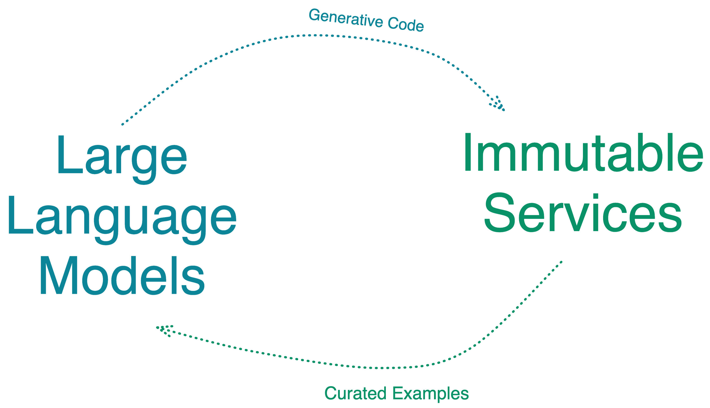
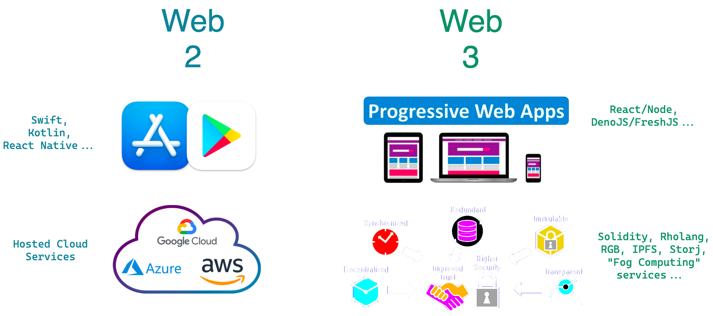
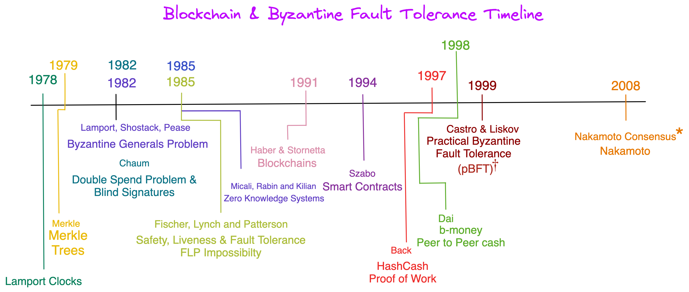
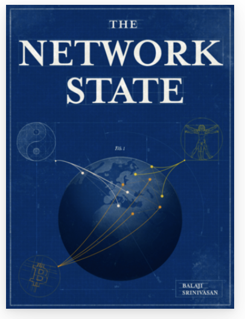

# Lecture 1

## Personal Introduction

## Motivation
    Money and Decentralized Computing
    Sovereign Technology

## History
- Printing Press & Central Banking
- Rise of Centralized Media
- Crash and Byzantine Fault Tolerant Computing
- Blockchains and Decentralized Technology
- Web 2 Business Models
- Sovereign Technology Opportunity

## Examples
- Video: [Sovereign Tech: Cost of Convenience](https://costofconvenience.film/)

## Introduction of AI
- Large Language Models for Coding
- Example: [Aider]

## Course Structure

### High Level Concept
<h5 style="text:italic" align="center"><em>

</img>

</em></h5> 

### Web 2 to 3

<h5 style="text:italic" align="center"><em>

</img>

</em></h5> 

### LLMs and Tech Stack

<h5 style="text:italic" align="center"><em>

</img>

</em></h5> 

## A Brief review of Bitcoin and Cryptocurrencies

<h5 style="text:italic" align="center"><em>

</img>

</em></h5> 

### Smart Contracts & Turing Completeness
- Solidity
- Cosmos SDK
- RGB...

## Solution/Problem Examples
- Censorship of Money
- Censorship of Services (e.g. Gmail)
- Privacy and Ownership (in AI - see genomic data)
- Government and Governance (e.g. FATF, Binance, & Developing World Insurance)

## AI and Tech Stacks
- See Tab

## Course Logistics
- Testing use of Discord
- Chat-GPT 4 use of Aider & OpenAI
- Notes and assignments on GitHub
- GitHub centric problems

## Grading
- See Canvas Syllabus

## Homework
-  `git clone git@github.com:github.com:jeffrey-l-turner/CPSC-370_BTC_derivates_AI_Chapman` # learn how to use ssh!
-  install [aider](https://github.com/paul-gauthier/aider) # figure out how to use with `anaconda`
- hook into Discord (instructions to be provided via Canvas & Slack)

## Other Details:
- IDE: VS Code or Vim preferred
- NixOS
- Slack or Discord

## References:
- The Network State
- Life After Capitalism

<h5 style="text:italic" align="center"><em>

</img>

</img>

</em></h5> 
