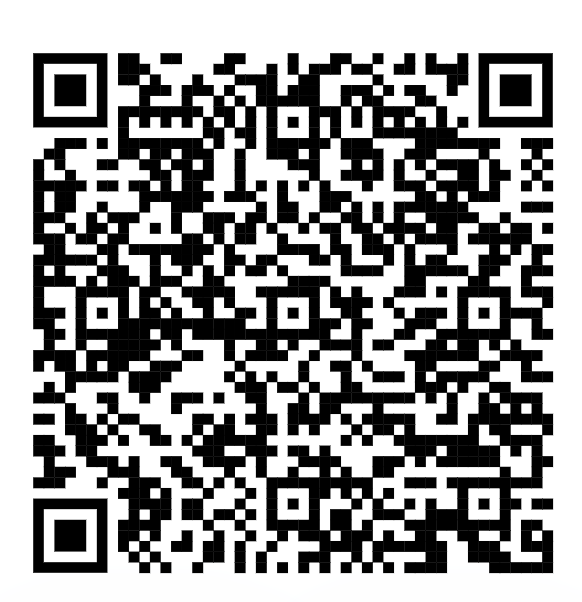
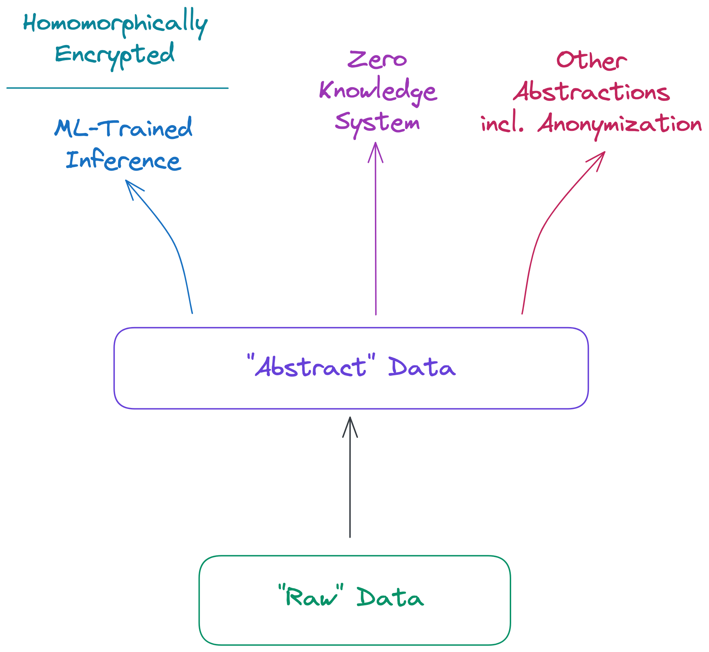
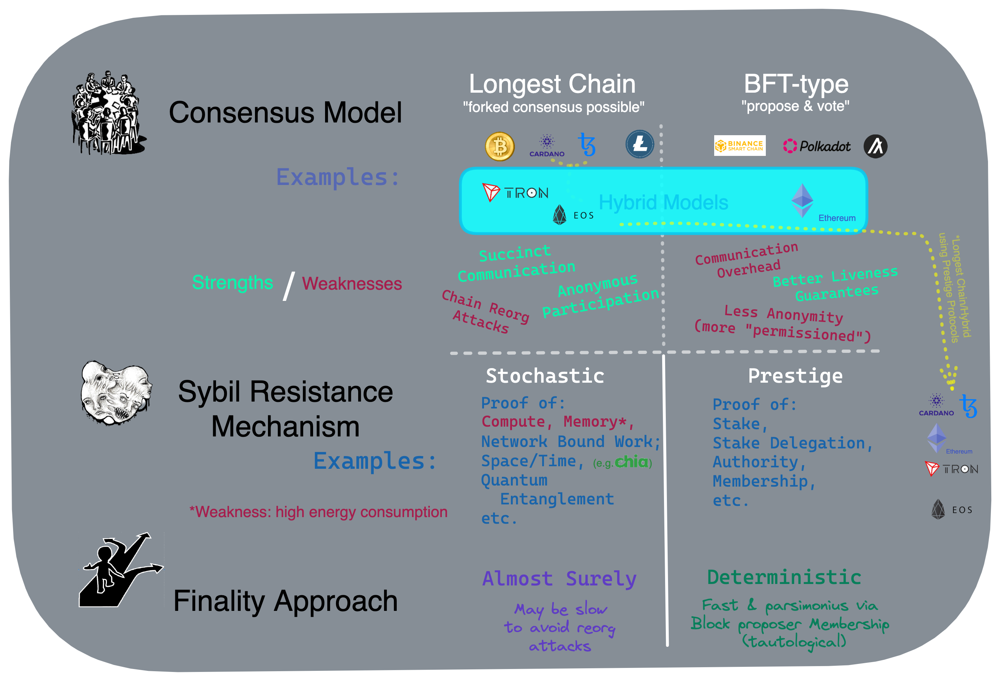
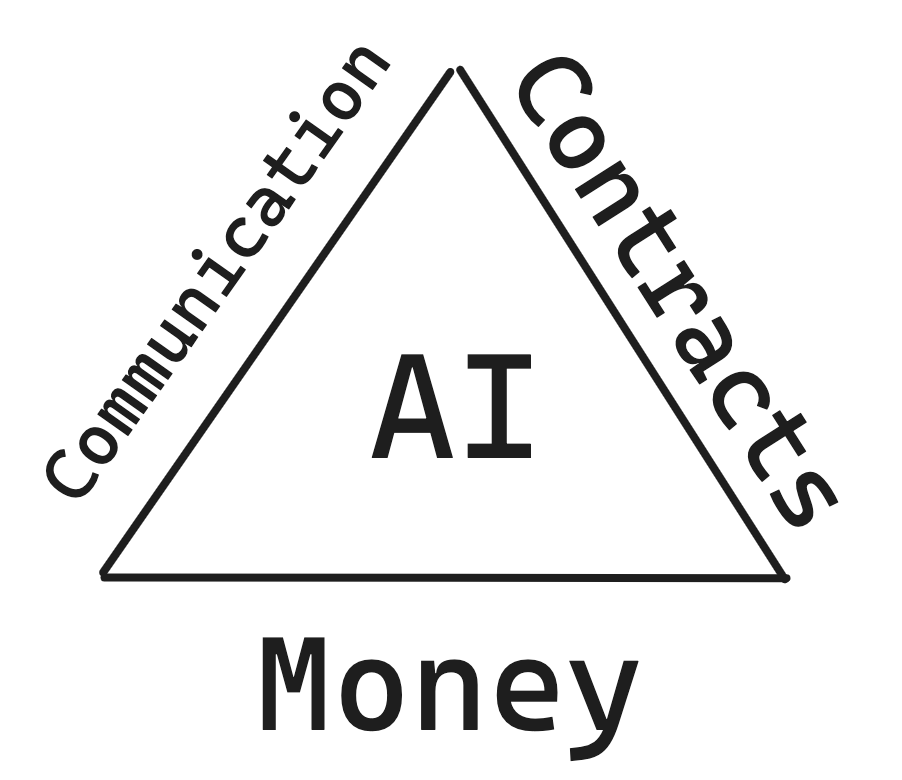
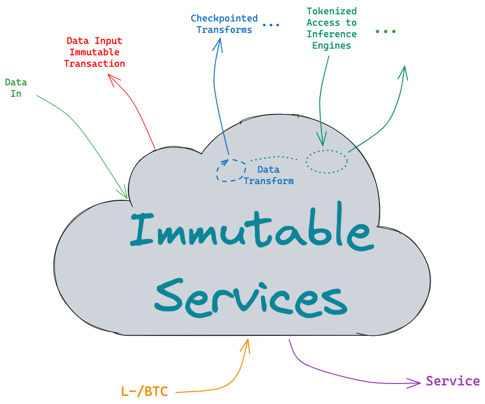

# Lecture 2

# Housekeeping

- Office Hours
- Update on 31 Aug. assignment
- Class Recordings
- Discord Server [https://discord.gg/pvaG4gSf](https://discord.gg/pvaG4gSf)
- OpenAI API key sponsor
- Code Llama release
- Quizes

# Lightning Bitcoin Demo

  
  
Android

  
  
Apple

## Concepts

- Byzantine Fault Tolerance (as opposed to Crash Fault Tolerance)
- Blockchains
- Smart Contracts
- "Decentralized" Computing
- Large Language Models and Token Windows (Temperature, Context, and Parameters)

## Data Structures, Algos, & Cryptographic Primitives (Non-Exhaustive)

- [Linked Lists](https://www.geeksforgeeks.org/data-structures/linked-list/)
- [Directed Acyclic Graphs (DAGs)](https://www.geeksforgeeks.org/graph-types-and-applications/?ref=Digraph)
- [One-way/Trap-door functions](https://onlydifferences.com/trapdoor-function-vs-one-way-function/)
- [Hash Functions](https://www.technipages.com/definition/one-way-hash-function/)
- [Encryption -- Symetric and Asymetric](https://preyproject.com/blog/types-of-encryption-symmetric-or-asymmetric-rsa-or-aes#:~:text=Asymmetric%20and%20symmetric%20encryption%20are,a%20private%20key%20for%20decryption.)
- [Blockchains](https://andersbrownworth.com/blockchain/)
- [Open Timestamps](https://petertodd.org/2016/opentimestamps-announcement)
- [Single Use Seals](https://petertodd.org/2017/scalable-single-use-seal-asset-transfer)
- [Merkel Trees](https://www.geeksforgeeks.org/introduction-to-merkle-tree/)
- [Turing Complete "Smart Contracts"](https://firstmonday.org/ojs/index.php/fm/article/download/548/469)
- ["Global" State](https://www.ics.uci.edu/~cs230/lectures20/distrsyslectureset3-win20.pdf)
- [Decentralized "Owned" State](https://github.com/orgs/RGB-WG/discussions/219)
- [Layer 1 and 2 Chains](https://medium.com/the-capital/layer-1-vs-layer-2-what-you-need-to-know-about-different-blockchain-layer-solutions-69f91904ce40)
- [Zero Knowledge Proofs](https://cointelegraph.com/explained/zero-knowledge-proofs-explained)

## Data & Immutable Services

- "Raw" personal data
- "Abstract" data
- Data Representations
- Sovereignty & Sequestration
- Provenance, Confidentiality, and Security

<h5 style="text:italic" align="center"><em>

</img>

</em></h5> 

## Ethereum/BFT Ethos

### Proof of Work vs Stake (the poor venacular for Sybil Resistance)

<h5 style="text:italic" align="center"><em>

</img>

</em></h5> 

### What is decentralization and "DINO?"

* [Lyn Alden](https://www.lynalden.com/proof-of-stake/)
* [Lane Rettig](https://www.whatbitcoindid.com/podcast/the-reality-of-web3)

## Bitcoin Maxi Viewpoint

- "Sound Money"
- Bitcoin Core, RSK, RGB, Taro, Bifrost...

<h5 style="width: 300px; height: 300px " align="center"><em>

</img>

</em></h5> 

## Artificial Intelligence - Provenance, Security, Privacy

<h5 style="text:italic" align="center"><em>

</img>

</em></h5> 

## Assignment & Upcoming Quiz

* [See Assignments](./assignments) 

## Resources

* [Bitcoin Simulator](https://andersbrownworth.com/blockchain/hash)
* [Merkel Trees](https://prathamudeshmukh.github.io/merkle-tree-demo/)
* [Verkle Trees](https://youtu.be/Q7rStTKwuYs?si=u0lTL3AsT0h6IHaq)
* [Joachim Neu on Proof Stake and Consensus](https://www.youtube.com/watch?v=2nMS-TK_tMw)
* [Bitcoin Core](https://bitcoin.org/en/bitcoin-core/)
* [RGB](https://www.rgbfaq.com/)
* [RSK](https://rootstock.io/)
* [Taro/Taproot Assets](https://docs.lightning.engineering/the-lightning-network/taproot-assets)

