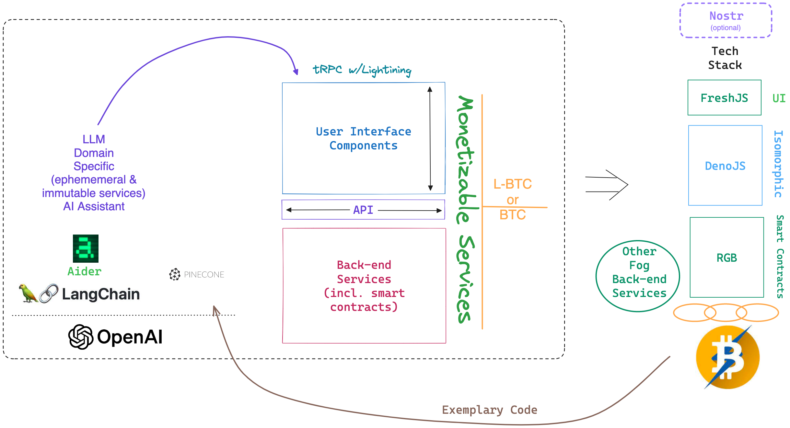

# Lecture 3

# Housekeeping

- Office Hours Updated -- DM me if help needed
- First quiz due Thurs. Working to resolve more thorough Canvas quiz system.
- Class Recording posted to Discord
- OpenAI API key delay
- Meta GPT release
- Role of Continuous Integration
- Business School Collaboration Opportunity (Canvas Survey)

# Python Setup

- [Homebrew Python](https://brew.sh/)
- [Python on Windows](https://www.digitalocean.com/community/tutorials/install-python-windows-10)
- [Anaconda Video](https://youtu.be/n83J8cBytus?si=utJUQxswL7j1jl0Y)
- [Anaconda Text Instructions](https://docs.conda.io/projects/conda/en/4.6.0/user-guide/install/index.html)

## Aider Installation

- [aider](https://github.com/paul-gauthier/aider)
- `conda create -n aider python=3.11.4`
- `conda activate aider`
- Instantiation

## Project Setup

- Git basics
- [NPM, node via NVM installation](https://github.com/nvm-sh/nvm) 
- [Using Parcel](https://parceljs.org/getting-started/webapp/)
- Using with Aider
- Generative code writing
- FreshJS & DenoJS with Aider (use React/Parcel)
- Integrating Aider feedback into our coursework

<h5 style="text:italic" align="center"><em>

</img>

</em></h5> 

## Assignment & Upcoming Quiz

* [See Assignments](./assignments) 

## Resources

* [Warp](https://app.warp.dev/referral/PXZMWP)
* 

