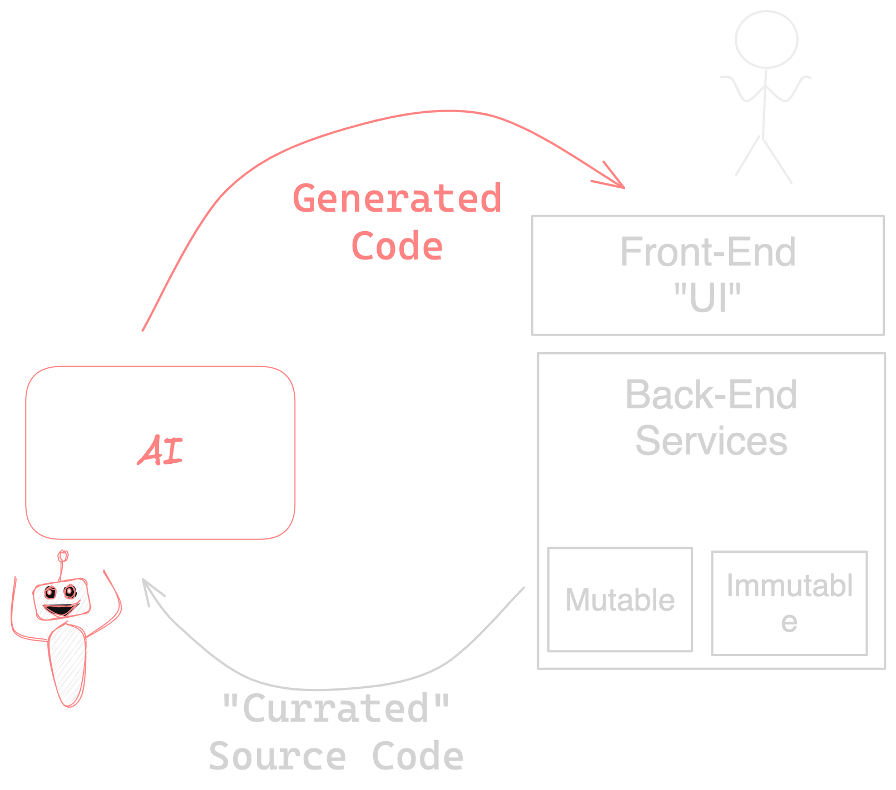

# Lecture 5

# Housekeeping

- Second quiz due Friday. Will review Tues. Canvas problems for some students...
- Class Recordings will be made available on permanent link; may need download
- GPT-3.5 Keys updated to GPT-4
- Business School collaboration update
- Revisiting git operations part of quiz today
- Remember to: `git pull upstream master` & `git push`
- Coding exercises -- as of Tues. AM 5 classmates have not used Aider; only way to fail assignment is to not use it for a little bit of coding; 
- Aider fork; will reveal more Thurs.

# Front-ends, back-ends, mutable, and immutable services

- The Browser as an Operating System
> * Layout Engine
> * Execution Environment
> * Intrinsic services
- Back-ends
> Virtual Machines vs "Bare Metal"
> Just in time, trace tree optimization, advances in Compiler technology
> NodeJS evolution to DenoJS:
> * Notable advancement Google's Chrome V8
- [Mutable and Immutable Services](./notes_lec5.md)
> * Mutability
> * Immutability

# Our Class Technology Stack

> Goal: Reinforcement ("Virtuous") Cycle

<h5 style="text:italic" align="center"><em>

</img>

</em></h5> 

- Back-ends

## Reminder: Evaluating Git Repo Pushes

- `.aider` commits
- Open AI API Key use
- May ask for `.aider` logs...

<h5 style="text:italic" align="center"><em>

</img>

</em></h5> 

## Quiz

* Due End of Day this Friday the 15th

## Resources for this Lecture

* [Aider](https://Aider.chat/)

