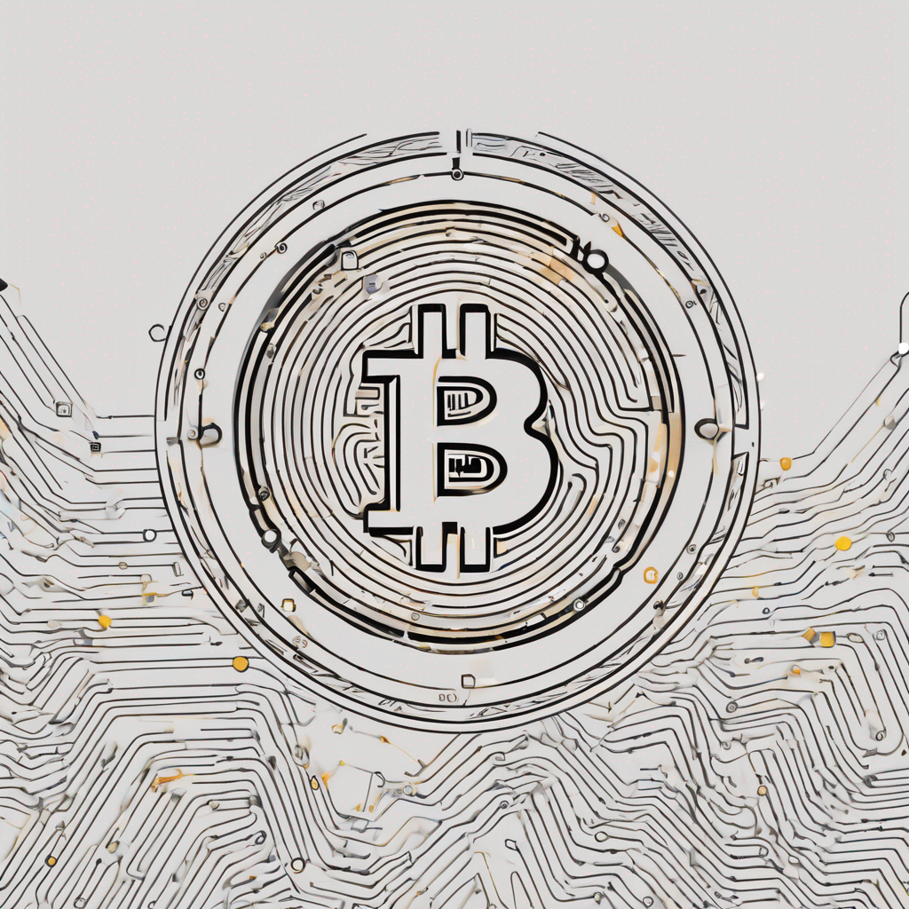

# Lecture 14

  

# Housekeeping

- Open Router Use Survey?
- Mid-term next week & Guest Lecture next Tues. 
- GitHub fix for Pull Requests -- still use my Chapman email (To be Demoed)
- Canvas Tech Support Issues; Quiz results delayed, Quiz to be published, Grading Rubric to be restored, and Mid-term review with IT Support
- Interesting Developments: LLM Hacking, Course on LLM Coding, BitVM, Nodeless & Geyser Fund

# A Survey of Decentralized Applications & Immutable Services:

## Layer 1 and 2 & the Oracle Problem Revisited
* Layer 1 "Base" -- Layer 2 as an Extension
* [Optimistic Rollups (generalized concurrency control)](https://en.wikipedia.org/wiki/Optimistic_concurrency_control)
* [ZK (Zero Knowledge) Rollups and others](https://vitalik.ca/general/2021/01/05/rollup.html)
* The Oracle Problem

## Cross-/Inter-Chain
* Decentralized Exchanges ("DeXs") [e.g. Uniswap](https://uniswap.org)
* Marketplaces:
> * Non-Fungible Tokens (NFTs) [e.g. Opensea](https://opensea.com)
> * Other Virtual Goods (games, tickets, rights management, etc.)
* [Decentralized Finance](https://defillama.com/)
* Gaming [e.g. Animoca](https://www.animocabrands.com/primary-game-products)
* Metaverse [e.g. Meta (Facebook) DApp ](https://www.coindesk.com/web3/2023/03/10/facebook-parent-company-meta-exploring-decentralized-app-report/)
* Identity [e.g. Worldcoin Orb](https://www.theguardian.com/technology/2023/jul/28/crypto-firm-wants-to-scan-your-eyeballs-worldcoin-privacy-ai)
* Insurance [e.g. Crop Ins.](https://chainlinktoday.com/march-2023-recap-etheriscs-chainlink-powered-crop-insurance-continues-to-scale-in-kenya-pwc-germany-partners-with-chainlink-labs-to-boost-enterprise-blockchain-adoption/) [- Kenyan Farmers](https://chainlinktoday.com/additional-7000-kenyan-farmers-protected-by-etheriscs-chainlink-powered-parametric-crop-insurance/)
* Data Federation, Provenance & Sequestration (whiteboard)
* Governance (on-chain/cross-chain)
* Bridging Services (& Cross-Chain Execution)

## Intra-Chain
* All of above
* Smart Contract "DApps"
* Decentralized Storage [e.g. IPFS](https://ipfs.tech/)
* Decentralized Social Media [e.g. Nostr](https://nostr.com/)
* Decentralized Resource Registration [ENS (e.g. Domain Name Systems)](https://ens.domains/) 
* Decentralized Identity (see above)
* Decentralized Autonomous Organization (DAO) Governance [(Now thousands)](https://www.investopedia.com/tech/what-dao/)

# [Suitability for Decentralized App Development](./notes_lec14.md)
- "Trustless" Interaction
- Service Immutability
- Generally, Community Driven Open Source
- Networked/Sovereign Security Model
- Zero Knowledge Potential

# Non-Suitability for Decentralization
- Institutionally Hierarchical
- Performant
- Centralized Authority
- Corporate/Institutional Security Model

# Assignment

* [Have Aider write and design a User Interface for a DApp of your choice](../assignments/12_Oct_2023.md)

## Resources mentioned in Lecture

* [Hackers Guide to LLMs](https://youtu.be/jkrNMKz9pWU?si=xum8ylFxrV9a9dS1) 
* [Practical Deep Learning for Coders](https://course.fast.ai/) 
* [BitVM](https://stephanlivera.com/episode/520/)
* [Nodeless](https://nodeless.io/)
* [Geyser Fund](https://geyser.fund)
