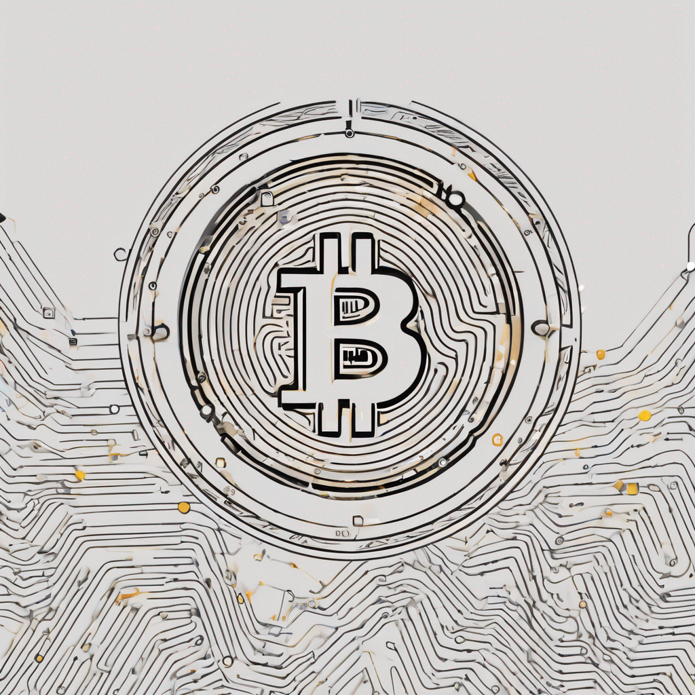

# Lecture 15

  

# Housekeeping

- Mid Term
- Help with PRs
- Mid-term Review
- PR Canvas Submissions (if not on GitHub)

# Pull Request Reviews

- Noah, Jaden, Paul, Chris, Jack, Gilberto, Carson

## Common Problems

## Resources

* [Zero Knowledge Proofs](https://blog.chain.link/zero-knowledge-proof-use-cases/)
* [Decentralized Tech Applications](https://www.investopedia.com/terms/d/decentralized-applications-dapps.asp)
