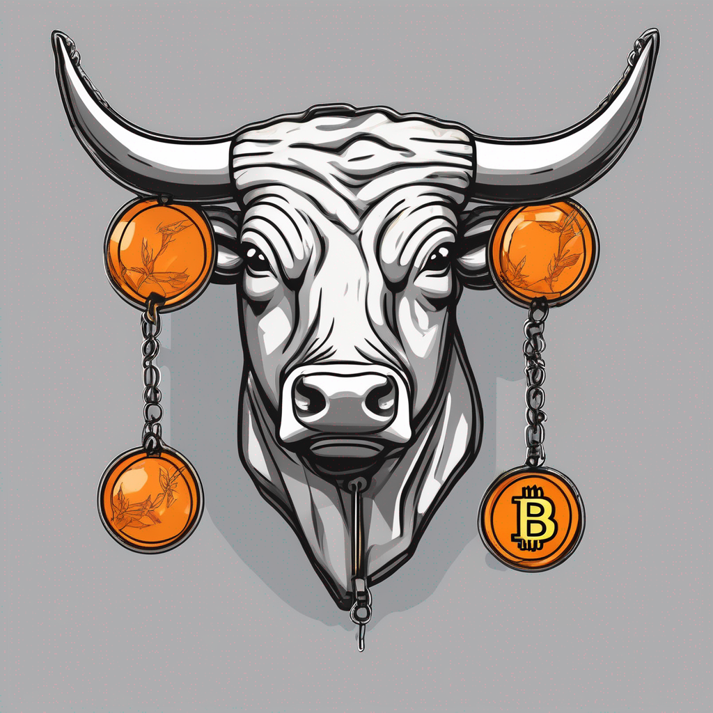

# Lecture 17

  

# Housekeeping

- [Student Services Satisfaction Survey (SSSS)](tbd)
- BTC/Crypto Rally & Crypto Crackdown
- OpenAI/OpenRouter Credits
- GitHub PR Reviews
- Assume everyone has GitHub properly established by now
- Visit office hours to Demo Mindmap for Quiz Boost: only if grades is under 80%
- Guest Lecturers next two classes 
- Next quiz out tomorrow

## Git Log revisited

- More examples on `HEAD`, `^`, `~`, & Hashes

## Flash Loans

- Non-BTC currently
- Useful paradigm
- Standard Contracts
- Only on Single Chain

## Insurance

* A simple game
* Concepts:
- * Risk Pooling: A game...
- * How can we measure risk?
- * How can we pool risk?
- * What are the counterparties?
* Traditional Centralized models verus Automated Smart Contract
- * Automation via Smart Contracts
* Applications
- * Etherisc: Etherisc is a decentralized insurance platform that uses smart contracts to automate the insurance process. Etherisc offers a variety of insurance products, including flight insurance, crop insurance, and weather insurance.
- * B3i: B3i is a blockchain-based insurance consortium that is being developed by a number of leading insurance companies. B3i aims to streamline the insurance claims process and reduce costs.
- * Nexus Mutual: Nexus Mutual is a peer-to-peer insurance platform that uses Ethereum to provide insurance to smart contracts. Nexus Mutual offers a variety of insurance products, including smart contract hack insurance and smart contract failure insurance.
- * [Lemonade](https://www.lemonade.com/blog/crypto-climate-coalition/)
- Weak political jurisdictions
- Lack of trust between operating parties
* [*Notes:*](./notes_lec17.md)

## RGB Setup
* For next class lecture
- * `brew install rustup`
- * `cargo install rgb`
- try: `rgb -h`

## Resources

* [Flash Loans and Trading Bots]()
