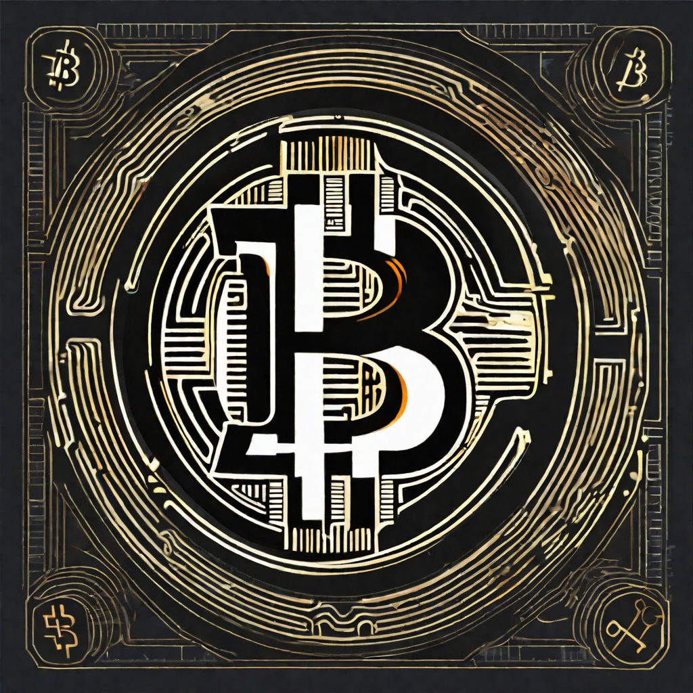

# Lecture 19

  

# Housekeeping

- GitHub PR Reviews -- please post in Discord after pushing in CI channel
- Reminder: Visit office hours to Demo Mindmap for Quiz Boost: should have received DM
- No Quiz this week; Double assignment from last week (see below)
- 3 Quiz errors, since corrected if taking today
- Aider will be much less helpful with these assignments; please show discernement in code accepted
- Guest Lecturer today -- Gregory Meredith

## Review Dr. Orlovsky's Lecture

- Sealed transactions
- How we can decentralize with new process calculi
- Fully distributed clique

## Guest Lecturer: Lucius Gregory Meredith

- Bitcoin History 
- Client Side Validation
- Prometheus

## RGB Setup and Assignment

Should have:
* For next class lecture
- * `brew install rustup`
- * `cargo install rgb`
- try: `rgb -h`

## Assignment

- [Head start for Thurs. Class ; no quiz this week](../assignments/31_Oct_2023.md)

## Resources

* [RGB Standards](https://github.com/rgb-org) 
