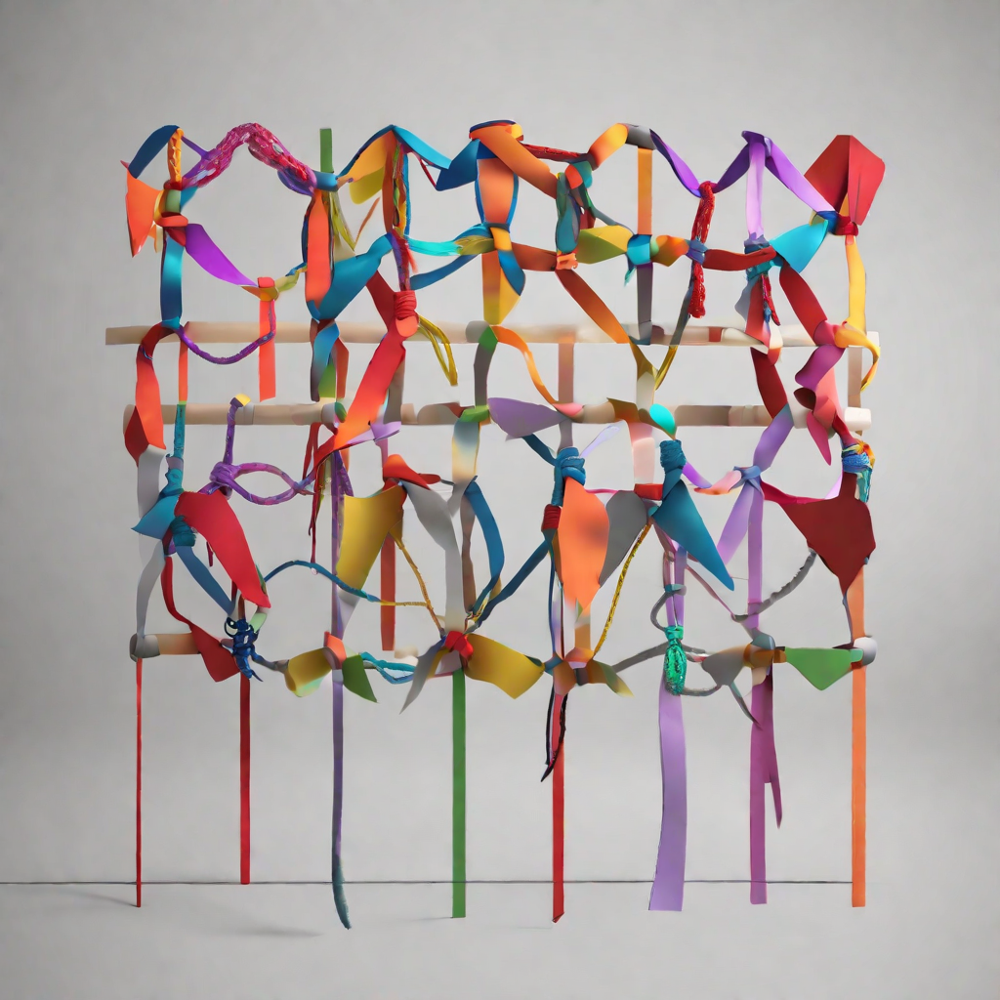

# Lecture 20

  

# Housekeeping

- GitHub PR Reviews -- please post LINK! in Discord via DM after updating in CI channel
- Reminder: Visit office hours to Demo Mindmap  or if doing mid-term makeup
- Reminder Aider will be much less helpful with these assignments; please show discernement in code accepted
- OpenRouter limits are fixed. So, DM me if you run out of credit

## Review Dr. Orlovsky's Lecture

- Sealed transactions part II
- How we can decentralize with new process calculi
- Fully distributed clique

## RGB part II

## Single Use Seals

* [SUS](./notes_lec20.md)

## Assignment

- [Head start for Thurs. Class ; no quiz this week](../assignments/31_Oct_2023.md)

## Resources

* [RGB Standards](https://github.com/rgb-org) 
* [Slides from Dr. Orlovsky](../docs/RGB_Lecture.pdf) 
