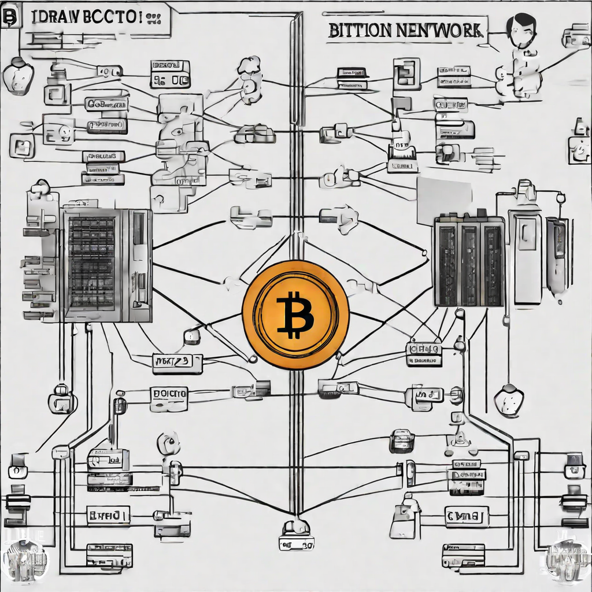

# Lecture 21

  

# Housekeeping

- GitHub PR Grading -- everyone can get at least 70%; check canvas for grades & GitHub PRs for feedback
- Reminder: Visit office hours to Demo Mindmap / use to review assignment feedback as well
- This Thurs. Office Hours shifted to morning; see Canvas and Discord for details
- OpenRouter limits are fixed. Checkout switch to new Open AI quadruple size context window
- New quiz should be available later today 
- SBF Trial/Sentencing...
- Canvas Survey for final project: review skills; Front-end, back-end, smart contracts, middleware (& languages, Python, TypeScript, Java...)

## Open Source Capital Markets

* Initial Coin Offerings and "Fly Wheel Business Models"
* Bitcoin and Altcoin capital raises and ethos are quite different
* [Coin Gecko](https://coingecko.com)

## Non-Fungible Tokens

- Not only used for Art...
- Bonding curves on Uniswap [explained](https://www.linumlabs.com/articles/bonding-curves-the-what-why-and-shapes-behind-it)
- Transferrable Names on ENS
- Proof of Presence/Attendance
- "Soul bound NFTs" [identity applicaion](https://vitalik.ca/general/2022/01/26/soulbound.html)
- [Cross/Intra-Gaming artifacts](https://g.co/bard/share/0810fe9da12c)
- [Useful in Secondary Markets](https://www.investopedia.com/terms/s/secondarymarket.asp)
- Tickets
- Many other applications...

## RGB final assignment

- [RGB part II](../assignments/31_Oct_2023.md)

## Resources

* [RGB Standards](https://github.com/rgb-org) 
* [Slides from Dr. Orlovsky](../docs/RGB_Lecture.pdf) 
