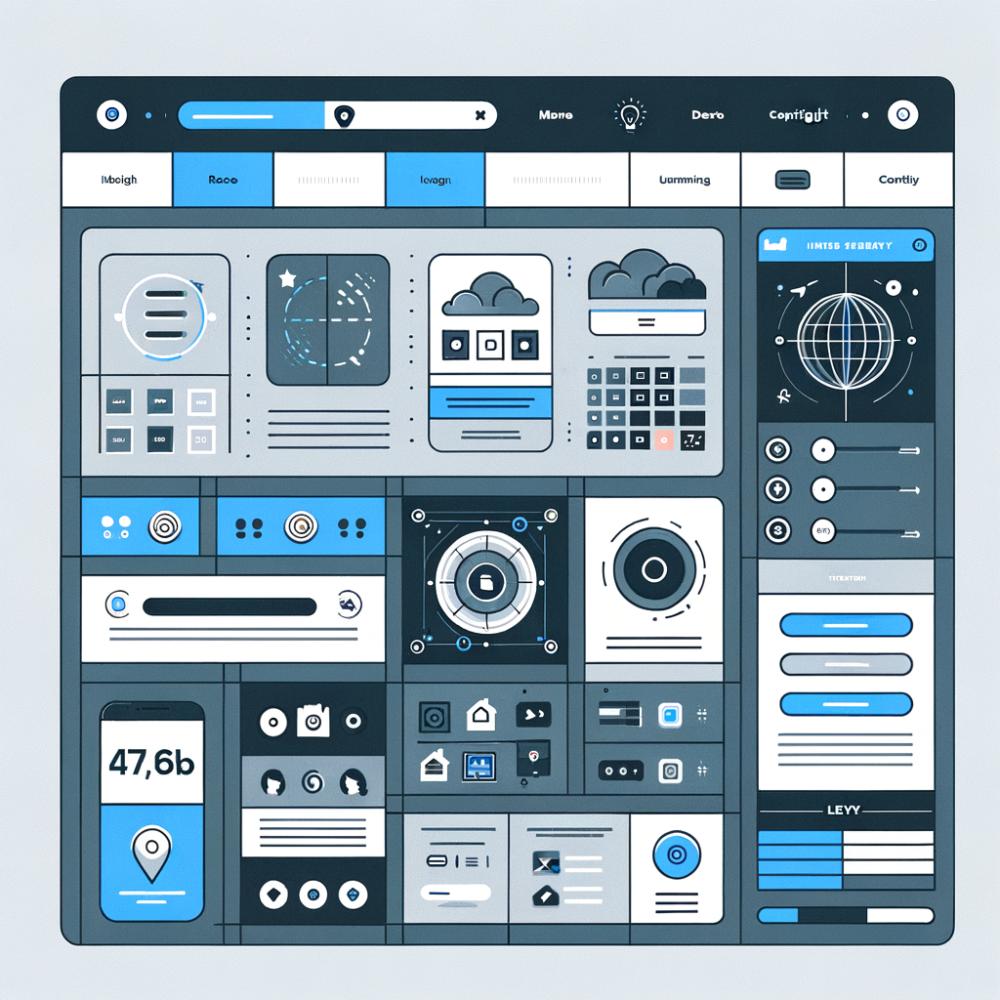

# Lecture 23

<div align="center">
  
</div>

# Housekeeping

- Reminder: Open Router credits are done
- `.aider.conf.yml` format:
```
openai-api-key: sk-<your_key>
model: gpt-4-1106-preview
```
- RGB final assignment issues; Will revisit Thurs.
- Grading assignments continued
- Canvas Quiz errors, will provide additional 2 pts in credit for Canvas problems
- Please respond to Canvas Survey if you haven't during class; will review before second lecture item
- Setting up lightning node with test L-BTC; may not be avail. until next week
- Likely one more quiz next week; continous programming assignment here on out...

## RGB part III (restarted)

* In class review; Corrected code

## Final Project Review revisited (as "Startup Engineering")

- Defining the Project
- Minimum Viable Product
- User Interface Design (overview of tools) & now [AI assistance](https://app.uizard.io/)
- * [Note](https://www.interaction-design.org/literature/topics/mobile-first): Mobile First approach, generally. Pay attention to landscape/portrait and desktop interfaces
- Back-end Services (databases, APIs/proxies, name resolution, oracles, etc.)
- Immutable Services (payments, smart contracts, oracle maintenance)
- Continuous Integration
- Project Standards (coding conventions, ecosystems used, code commit/maintenance process)
- Framework: Agile software development approach & tickets ([we're using GitHub]()https://github.com/jeffrey-l-turner/CPSC-370_BTC_derivates_AI_Chapman/issues/new)
- AI assistance (new approach) -- going to try: `formal specification`, `type/schema specification`, `code generation`, `unit testing`

## Start-in on User Interface design

- TBD: Which DApp will we do?
- Groups:
- * Design
- * User Interface
- * Back-End
- * Quality Assurance (Software Engr. approach to AI)

## Resources

* [In class drawing - Dating App](../Dating-DApp/data_ideation.png)
* [RGB part II assignment](../assignments/31_Oct_2023.md)
* [Humane AI Pin](https://mashable.com/article/humane-ai-pin-futuristic-features)
* [ACM Meetup](https://meetu.ps/e/MBXNY/hvZVH/i)
* [Economic Impact of AI](https://podcasts.apple.com/us/podcast/what-bitcoin-did/id1317356120?i=1000632835640)
