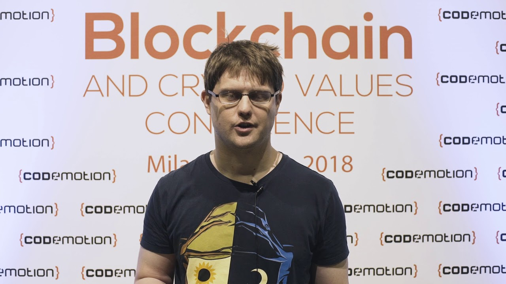

# Nick Szabo, Smart Contracts, and the Evolution of Blockchain Programming

  
  </img>

  
  </img>

  
  </img>

Nick Szabo, a computer scientist, legal scholar, and cryptographer, is widely recognized for his contributions to the field of digital contracts and digital currency. He introduced the concept of "smart contracts"—self-executing contracts where the terms and conditions are embedded within lines of code. The aim was to use a decentralized ledger to store contracts, which could then use cryptographic protocols to enhance transaction security.

The advent of Ethereum in 2015 marked a significant leap towards the realization of Szabo's vision. Ethereum's co-founder, Gavin Wood, introduced Solidity, a contract-oriented programming language tailored for implementing smart contracts on Ethereum. Solidity expanded on Bitcoin's scripting language, adding the ability to create programmable transactions, or smart contracts. This language allowed developers to write applications that emulate legal contracts, crowdfunding, voting, and multi-signature wallets, among others.

However, Solidity was not without its challenges. Its infamous security issues led to several high-profile breaches, such as the DAO hack in 2016. Over time, other blockchains developed their own languages for smart contract programming. For instance, Cardano introduced Plutus, based on the functional programming language Haskell, while Tezos uses Michelson, designed for formal verification, which facilitates mathematical proof of code correctness.

Recently, smart contracts have been extended to Bitcoin with systems like Really Good Bitcoin (RGB), developed by Peter Todd and Maxim Orlovsky. RGB is an open-source protocol and development toolkit that enables smart contracts and tokenized assets on the Bitcoin network. It leverages Bitcoin's security model and broadens its capabilities beyond just transferring BTC between parties.

The design philosophies underlying Solidity and RGB reflect different views on how smart contracts should interact with the underlying blockchain. Solidity, and by extension the Ethereum Virtual Machine (EVM), employs a 'centralized state' approach. All nodes on the Ethereum network process every transaction, leading to a 'global state consensus'. This implies that all nodes must agree on the state of all smart contracts on the Ethereum blockchain.

In contrast, RGB adopts a 'client-side validation' model, which is a significant departure from the EVM's approach. With client-side validation, only the parties involved in a specific smart contract track its state. This approach leverages Bitcoin's existing security model and improves RGB's scalability by reducing the amount of data that all nodes must process. By trusting that the involved parties are accurately maintaining the state of their contracts, RGB can bypass global consensus and operate more efficiently.

In conclusion, the evolution of smart contract programming, from Gavin Wood's Solidity to Peter Todd and Maxim Orlovsky's RGB, illustrates the ongoing development and realization of Nick Szabo's pioneering concept of smart contracts. These innovations have revolutionized the way transactions are conceived and conducted, laying the foundation for a future where digital, self-executing contracts could become the norm.
