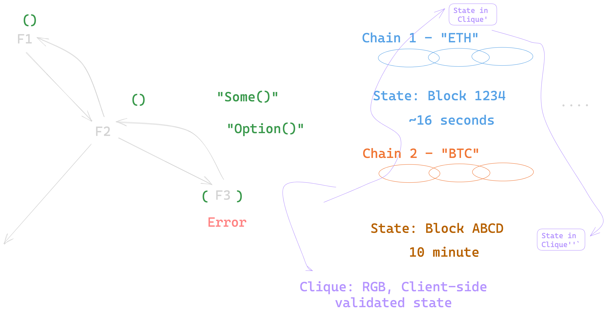

## JavaScript/Typescript
- Dependency Management: `package.json` (NodeJS) or `mod.deps.ts` (DenoJS)
- Packages: `npm` or Git commits (with Deno)
- Frameworks: `AngularJS`, `ReactJS`, `FreshJS`, etc.

## Python
- Dependency Management: `requirements.txt`
- Packages: `pip install`
- Frameworks: `AngularJS`, `ReactJS`, `FreshJS`, etc.

## Rust
- Dependency Management: `cargo.toml`
- Packages: crates
- Frameworks/Libraries: crate.io

## Others:
- Scala/Java: sbt, build.sbt, maven/ivy artifacts
- Mojo: to be investigated

# Cross-Chain Functional Programming

  
  
Lecture Diagram

